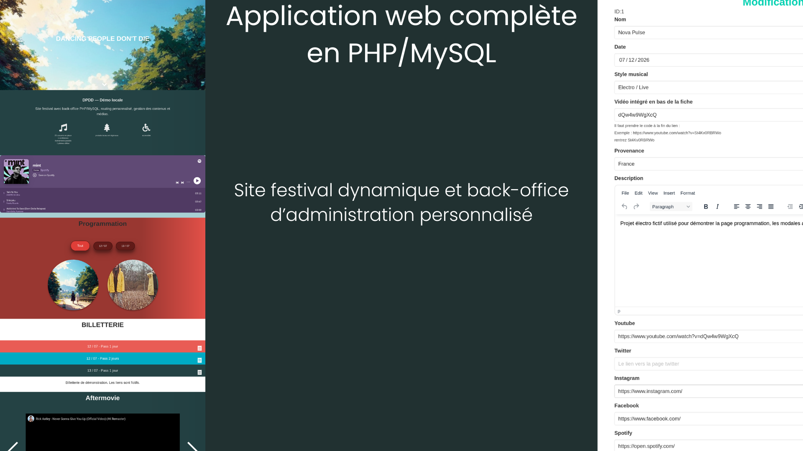

# DPDD



## Application web complète en PHP/MySQL  
### Site festival dynamique et back-office d’administration personnalisé

DPDD est une application web développée en **PHP / MySQL** pour gérer le site d’un festival et son **back-office d’administration**.  
Le projet combine une **interface publique dynamique** et un **espace administrateur** permettant de gérer les contenus du site.

---

## Aperçu

Le projet comprend :

- un **front-office** public pour présenter le festival
- un **back-office** protégé par authentification
- la gestion des **artistes**
- la gestion de la **billetterie**
- la gestion des **partenaires**
- la gestion des **contacts**
- la gestion du **carrousel vidéo**
- la gestion de la **mise en page**
- l’upload et la mise à jour d’images

L’application suit une architecture **MVC simple en PHP natif** avec routage via Apache.

---

## Fonctionnalités

### Front-office
- page festival dynamique
- affichage des artistes
- filtres par date
- modales de détail artiste
- section billetterie
- section partenaires
- section contacts
- intégration playlist Spotify
- intégration vidéos YouTube
- contenus éditoriaux modifiables

### Back-office
- authentification administrateur
- création, modification et suppression d’artistes
- gestion de la billetterie
- gestion des partenaires et catégories
- gestion des contacts
- gestion du carrousel vidéo
- modification des contenus de mise en page
- upload d’images

---

## Stack technique

- **PHP**
- **MySQL / MariaDB**
- **Apache**
- **HTML / CSS / JavaScript**
- **TinyMCE**
- **Docker / Docker Compose**

---

## Structure du projet

```
controller/   logique applicative
models/       accès aux données
views/        rendu HTML
docker/init/  base SQL de démonstration
tinymce/      éditeur de contenu
```

Lancer le projet avec Docker

Prérequis
Docker
Docker Compose

Démarrage
```
docker compose down -v --remove-orphans
docker compose up --build
```
Accès

Front : http://localhost:8080/
Back-office : http://localhost:8080/back/login

Compte administrateur de démonstration

login : admin
mot de passe : admin

Permissions pour les uploads

En environnement Docker avec volume monté, le dossier d’images doit être inscriptible pour permettre l’upload des médias.

chmod -R 777 views/festival/images
Base de démonstration

Le projet inclut un fichier SQL de démonstration chargé automatiquement au démarrage via Docker.
Il permet de recréer rapidement un environnement local avec :

un administrateur de démo
une page festival visible
des artistes fictifs
des billets fictifs
des partenaires fictifs
des contacts fictifs
des contenus éditoriaux de démonstration
Ce que ce projet met en valeur

Ce projet illustre :

la réalisation d’une application web complète
la mise en place d’un front-office + back-office
le développement d’une architecture MVC en PHP natif
la gestion de contenus métier
l’utilisation de Docker pour simplifier l’exécution locale
la manipulation de formulaires, uploads et contenus dynamiques
Améliorations possibles
externaliser la configuration avec un fichier .env
améliorer la sécurité de l’authentification
renforcer la validation des entrées utilisateur
ajouter des tests
améliorer l’ergonomie du back-office
mieux gérer les médias et les fichiers uploadés
améliorer le responsive de certaines vues
nettoyer et moderniser certaines parties du code historique
Contexte

Ce dépôt correspond à un projet de site festival avec interface d’administration, repris et remis en état pour être exécutable localement avec Docker et une base de démonstration, afin de le rendre présentable sur GitHub et dans un portfolio.
